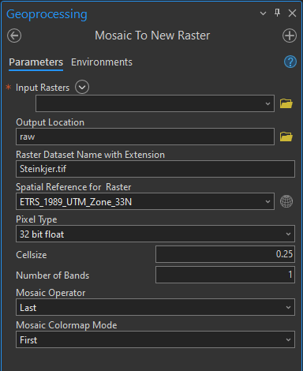
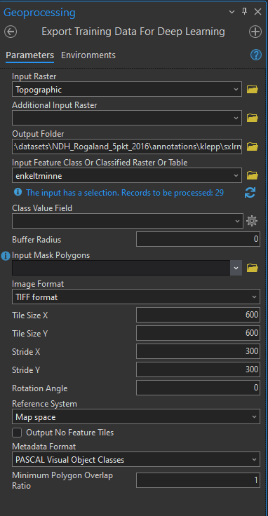

# Image Preprocessing in ArcGIS Pro

## Prerequisites
### 1. ArcGIS Pro
ArcGIS Pro with one of the following licenses:
- 3D Analyst
- Spatial Analyst

### 2. Relief Visualization Toolbox (optional)

  The [Relief Visualization Toolbox](https://rvt-py.readthedocs.io/en/latest/index.html) includes ready to use raster functions, specifically for elevation datasets, and simplifies the process of of calculating `Multi-Scale Relief Model` and `Simple Local Relief Model`. See [RVT Installation Guide](https://rvt-py.readthedocs.io/en/latest/install_arcgis.html#install-arcgis).

## Workflow
### Prepare Ground Truth Database
1. Download the cultural heritage database from [GeoNorge](https://geonorge.no). The dataset are called `Enkeltminner` and can be found here: [https://kartkatalog.geonorge.no/metadata/kulturminner-lokaliteter-enkeltminner-og-sikringssoner/c72906a0-2bc2-41d7-bea2-c92d368e3c49](https://kartkatalog.geonorge.no/metadata/kulturminner-lokaliteter-enkeltminner-og-sikringssoner/c72906a0-2bc2-41d7-bea2-c92d368e3c49).
2. Import the downloaded file to ArgGIS Pro. Go to `Catalog` pane, right click on `Databases` directory and then `Add Database`. 

3. Open a new map.
4. The imported database includes a feature class called `enkeltminne`. Drag this into the map. 
5. Apply a filter to the feature class to only show burial mounds. Go to `Contents` pane. Right click on the feature class to display `properties` window. Go to the `Definition Query` tab, and apply the following SQL filter:
```
enkeltminneart IN (1702, 1703) AND vernetype NOT IN ('FJE')
```
The database design documentation can be found [here](https://objektkatalog.geonorge.no/Objekttype/Index/EAID_3736F10E_99EC_4ddb_9FBF_EF8ED91AEEB2). 

There are some grave fields that are missing individual boxes or is not clearly visible in the visualization. These burial mounds should be excluded form the datasets:
Witin the edit tap, click `Select` and then select the feature you want to delete:
-----image-----
Next, click on the `Delete` button:
-----image-----
If the mound has wrong placement you can move and scale the feature by right clicking on it while it is selected. Then click `move` or `scale`.

### Prepare LiDAR data

1. Download LiDAR data from [Norwegian Mapping Authority](https://hoydedata.no).
2. Import the downloaded data into a chosen (temporarily) folder.
3. Merge parts into one raster using `Moasic to New Raster` tool in ArcGIS Pro. 

    

4. Calculate selected relief models.


### Annotation
Use the `Export Training Data for Deep Learning` tool for each relief model.    


The parameter `minimum polygon overlap ratio` is the percentage for a feature to be included in the training data. If the percentage overlap is less than the value specified, the feature will be excluded from the training chip, and will not be added to the label file. See [Export Training Data For Deep Learning](https://pro.arcgis.com/en/pro-app/latest/tool-reference/image-analyst/export-training-data-for-deep-learning.htm). In this project, the value was set in the range [0.9, 1].